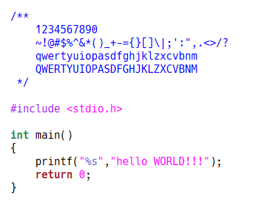

# a-custom-Hack-Font
Modefied the Hack font "i" and "1" (hinted by ttfautohint)

## What does it look like
> the image below is in Win10 Gvim(1366*768)

## QAs
according to [issue 482](https://github.com/source-foundry/Hack/issues/482) from [Hack](https://github.com/source-foundry/Hack) repository, we need comment out all uncommented lines in these files: `<Hack-src-root-path>/postbuild_processing/tt-hinting/*.txt`.

## Note
- the Hack font official repository is [source-foundry/Hack](https://github.com/source-foundry/Hack).
- the official font looks like below:

